# Native Android Sensor Implementation — Technical Deep Dive

> **Audience:** Developers who are new to Flutter platform channels, Android sensors, or both.  
> **Goal:** Explain exactly how sensor data travels from the phone's physical hardware all the way to the Flutter UI, step by step.

---

## Table of Contents

1. [Big Picture — What We Are Building](#1-big-picture)
2. [Android SensorManager — How It Works](#2-android-sensormanager)
3. [Accelerometer vs Gyroscope — What Each Sensor Measures](#3-accelerometer-vs-gyroscope)
4. [SensorEventListener — Receiving Sensor Updates](#4-sensoreventlistener)
5. [EventChannel vs MethodChannel — Why We Chose EventChannel](#5-eventchannel-vs-methodchannel)
6. [How EventChannel Streams Data to Flutter](#6-how-eventchannel-works)
7. [Sensor Registration and Unregistration Lifecycle](#7-sensor-lifecycle)
8. [Threading and Performance Considerations](#8-threading-and-performance)
9. [File-by-File Explanation](#9-file-by-file-explanation)
10. [Complete Data Flow: Hardware to UI](#10-complete-data-flow)
11. [Error Handling and Cleanup Logic](#11-error-handling-and-cleanup)
12. [Sequence Diagram: Full Request Lifecycle](#12-sequence-diagram)

---

## 1. Big Picture

Before diving into individual components, here is the high-level architecture of how the entire system fits together.

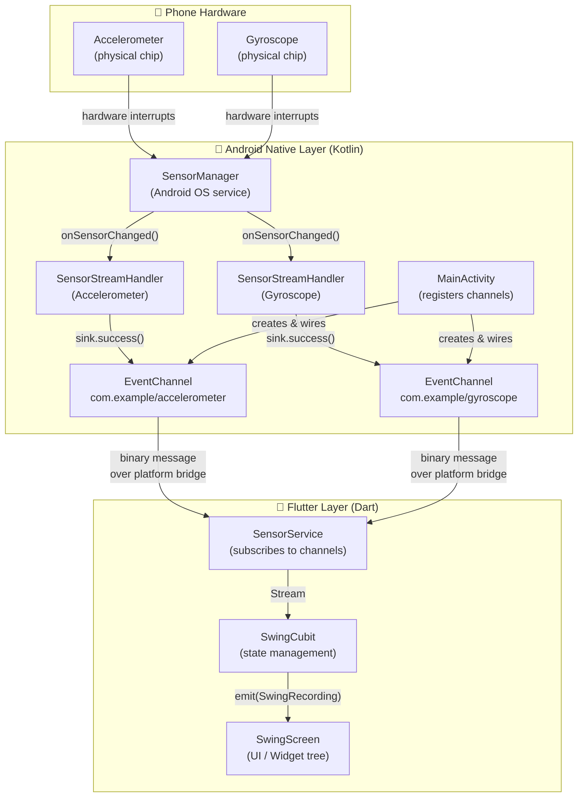

**Key insight:** The phone has physical sensor chips that detect movement. Android's OS reads these chips and delivers readings to our Kotlin code. Our Kotlin code packages those readings and sends them through a "bridge" into Flutter. Flutter's Dart code then processes the data and updates the UI.

---

## 2. Android SensorManager

### What Is SensorManager?

`SensorManager` is a system service provided by Android OS. Think of it as a switchboard operator that sits between your app and the physical sensor hardware. You never talk to the hardware chip directly — you always go through `SensorManager`.


### How We Get a Reference to SensorManager

In [SensorStreamHandler.kt](../android/app/src/main/kotlin/com/example/flutter_project/SensorStreamHandler.kt#L72), we obtain it like this:

```kotlin
sensorManager = context.getSystemService(Context.SENSOR_SERVICE) as SensorManager
```

- `context` is the Android `Activity` context passed down from `MainActivity`.
- `Context.SENSOR_SERVICE` is a string constant that identifies which OS service we want.
- `getSystemService()` returns an `Object`, so we cast it to `SensorManager`.

This call is cheap — `SensorManager` is a singleton inside Android. You are not creating a new object; you are getting a reference to the one that already exists in the OS.

### How We Ask for a Specific Sensor

```kotlin
val sensor = sensorManager?.getDefaultSensor(sensorType)
```

- `getDefaultSensor(sensorType)` returns the best available sensor of the requested type, or `null` if the device does not have one.
- `sensorType` is an integer constant such as `Sensor.TYPE_LINEAR_ACCELERATION` or `Sensor.TYPE_GYROSCOPE`.

**Important:** Modern phones often have more than one physical accelerometer chip (e.g., one optimized for low power). `getDefaultSensor()` picks the OS-recommended one automatically.

### Registering a Listener

```kotlin
sensorManager?.registerListener(this, sensor, samplingPeriodUs)
```

| Parameter | Type | Our Value | Meaning |
|---|---|---|---|
| `listener` | `SensorEventListener` | `this` | The object that will receive events |
| `sensor` | `Sensor` | the sensor object | Which sensor to read |
| `samplingPeriodUs` | `Int` | `50_000` | Desired interval in **microseconds** |

`50_000 µs = 50 ms = 20 readings per second (20 Hz).`

> **Note on "desired" rate:** The `samplingPeriodUs` value is a *hint*, not a guarantee. Android may deliver events faster or slower depending on system load, hardware capability, and batching. The OS tries to honor the hint, but your code should never assume exactly 50 ms between events.

---

## 3. Accelerometer vs Gyroscope

### What Each Sensor Measures

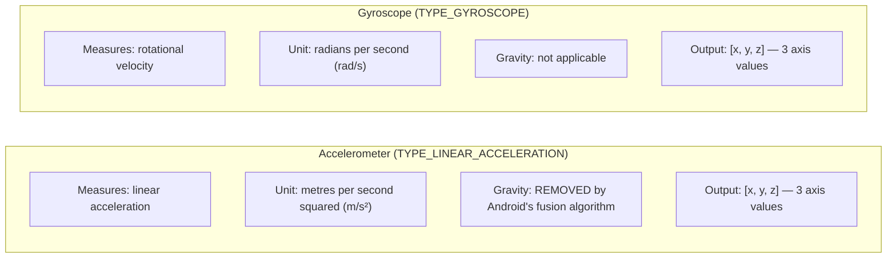

### The Axis Coordinate System

Both sensors share the same three-axis coordinate system, relative to the phone's natural (portrait) orientation:

```
        +Y  (top of phone)
         ▲
         │
         │
─────────┼─────────→ +X  (right side of phone)
         │
        ╱
      ╱
    ╱
  ▼
+Z  (out of the screen, toward your face)
```

### Why TYPE_LINEAR_ACCELERATION and Not TYPE_ACCELEROMETER?

`TYPE_ACCELEROMETER` includes Earth's gravity (~9.8 m/s² constantly pulling down). If you hold the phone still, it still reports a large value because of gravity.

`TYPE_LINEAR_ACCELERATION` uses Android's sensor fusion (combining accelerometer + gyroscope data internally) to subtract gravity. So when the phone is still, all three axes report ~0. Only your hand movement causes non-zero values. This is exactly what we want for swing detection.

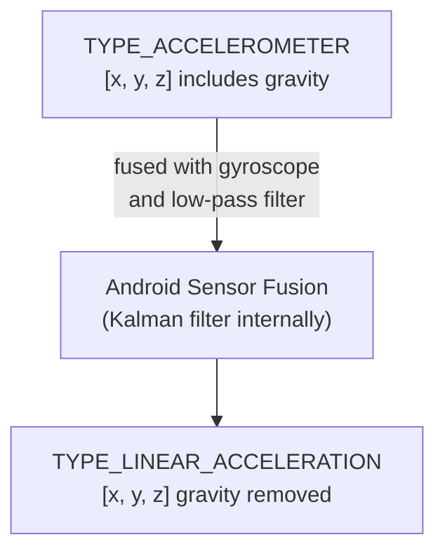

---

## 4. SensorEventListener

### What Is It?

`SensorEventListener` is an **interface** (a contract) defined by Android. When your class implements it, you promise to provide two methods:

```kotlin
interface SensorEventListener {
    fun onSensorChanged(event: SensorEvent?)
    fun onAccuracyChanged(sensor: Sensor?, accuracy: Int)
}
```

`SensorStreamHandler` implements both of these. The Android OS calls them automatically when new data arrives.

### onSensorChanged — The Core Method

```kotlin
override fun onSensorChanged(event: SensorEvent?) {
    val sink = eventSink ?: return       // (1) bail if Flutter isn't listening
    val values = event?.values ?: return // (2) bail if no data

    sink.success(                        // (3) forward to Flutter
        listOf(
            values[0].toDouble(),
            values[1].toDouble(),
            values[2].toDouble(),
        )
    )
}
```

Step by step:

1. **Guard clause on `eventSink`:** If Flutter has not subscribed (or has already cancelled), `eventSink` is `null`. We return immediately — there is nowhere to send the data.
2. **Guard clause on `event?.values`:** The Android framework *can* theoretically deliver a `null` event in edge cases. The safe call (`?.`) plus `?: return` defends against this.
3. **`sink.success(list)`:** The data is packaged as a Dart-compatible `List<Double>` and sent across the platform bridge. The `success()` method queues this as a normal data event.

### onAccuracyChanged — Not Used

```kotlin
override fun onAccuracyChanged(sensor: Sensor?, accuracy: Int) {
    // No-op — accuracy changes do not affect swing analysis.
}
```

This fires when the sensor's reported accuracy level changes (e.g., from `SENSOR_STATUS_ACCURACY_HIGH` to `SENSOR_STATUS_ACCURACY_MEDIUM`). For swing analysis this does not matter — we still want all readings regardless of accuracy status — so we do nothing.

### How Often Does onSensorChanged Fire?

With our 50,000 µs (50 ms) sampling period, `onSensorChanged` fires approximately **20 times per second**. At each call, the `SensorEvent.values` float array contains the three most recent axis readings.

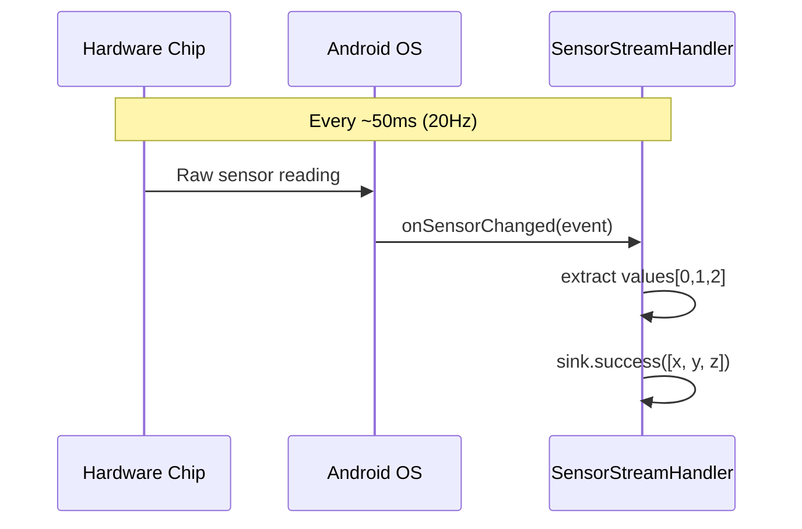

---

## 5. EventChannel vs MethodChannel

Flutter's platform channel system offers several channel types. The two most common are `MethodChannel` and `EventChannel`. Understanding why we chose `EventChannel` is important.

### MethodChannel — Request/Response

`MethodChannel` works like a regular function call. Flutter asks "give me the sensor data right now" and Android replies once with a single answer.

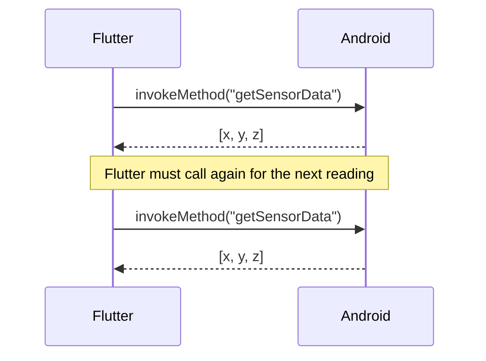

**Problems with MethodChannel for sensors:**
- Flutter would need to poll 20 times per second (every 50 ms)
- Each poll adds latency and overhead
- Flutter has to manage the timing loop itself
- It fights against the way Android's sensor API is designed (push-based, not pull-based)

### EventChannel — Continuous Stream

`EventChannel` works like subscribing to a live feed. Android *pushes* data to Flutter whenever new sensor data arrives. Flutter just listens.

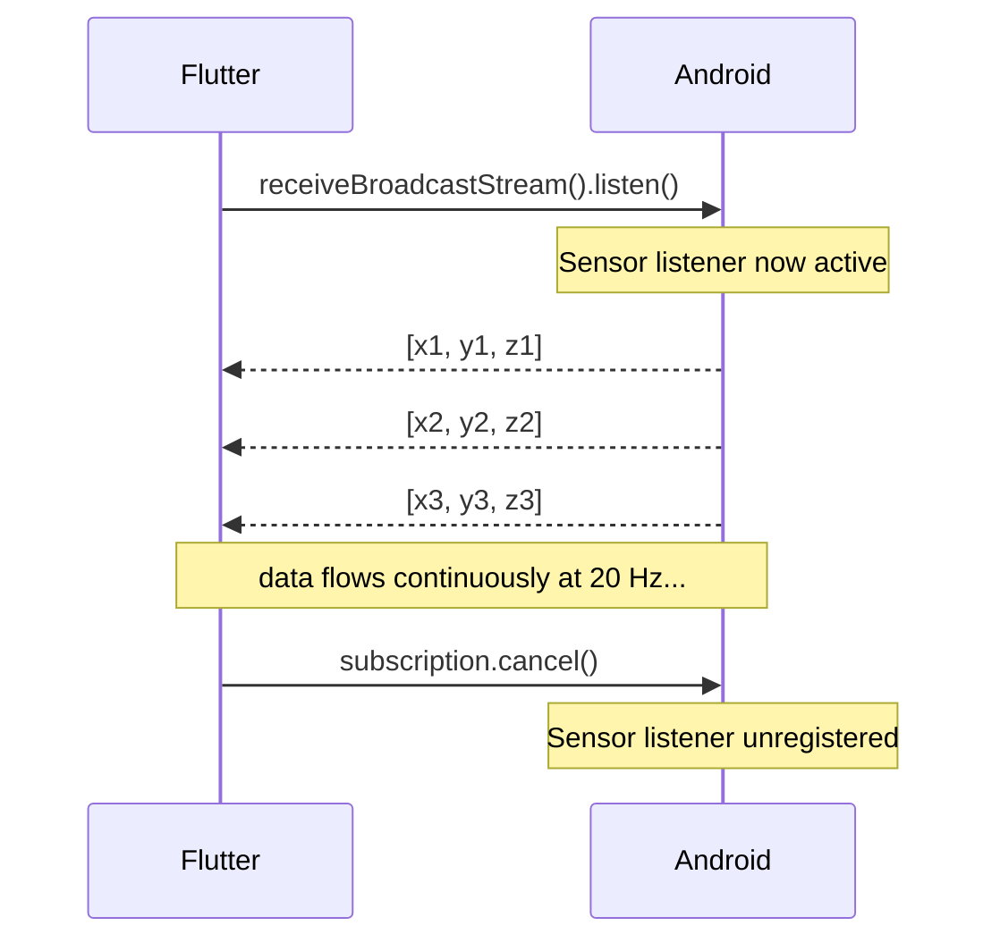

**Why EventChannel is correct here:**
- Matches the sensor API's push model perfectly
- No polling overhead — Android calls us when data is ready
- Single subscription setup instead of 20 calls per second
- Cancellation automatically cleans up the hardware listener
- Flutter receives data as a native `Stream<dynamic>` — idiomatic Dart

### Summary Table

| Concern | MethodChannel | EventChannel |
|---|---|---|
| Data delivery | Pull (Flutter asks) | Push (Android sends) |
| Suited for | One-shot operations | Continuous streams |
| Sensor polling needed? | Yes (20× per second) | No |
| Dart API | `Future<T>` | `Stream<T>` |
| Overhead | High (repeated calls) | Low (one setup) |
| Our choice | ❌ | ✅ |

---

## 6. How EventChannel Streams Data to Flutter

### The Bridge Architecture

The platform channel acts as a bidirectional communication pipe between the Dart VM and the Android JVM. Data is serialized to binary when crossing and deserialized on the other side.

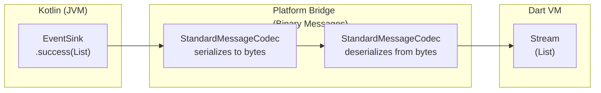

### Type Mapping (Kotlin → Dart)

Android uses the `StandardMessageCodec` by default, which maps types automatically:

| Kotlin Type | Dart Type |
|---|---|
| `List<Double>` | `List<dynamic>` |
| `Double` | `double` |
| `String` | `String` |
| `null` | `null` |

So when Kotlin sends `listOf(1.23, 4.56, 7.89)`, Dart receives a `List<dynamic>` containing three `double` values. That is why [sensor_service.dart](../lib/features/swing/services/sensor_service.dart#L98) casts the data:

```dart
final data = event as List;
_accelX = (data[0] as num).toDouble();
_accelY = (data[1] as num).toDouble();
_accelZ = (data[2] as num).toDouble();
```

The `as num` cast handles both `int` and `double` without crashing, which is defensive programming at the boundary between the two runtimes.

### The Three Types of EventSink Events

An `EventSink` can send three kinds of signals to Flutter:

| Method | Dart Effect | When We Use It |
|---|---|---|
| `sink.success(data)` | Normal stream event | Every sensor reading |
| `sink.error(code, msg, details)` | Stream error event | Sensor unavailable |
| `sink.endOfStream()` | Stream closes | (not used — sensor runs until cancelled) |

---

## 7. Sensor Registration and Unregistration Lifecycle

This is one of the most critical parts of the implementation. Getting this wrong causes **battery drain**, **crashes**, or **data leaks**.

### Lifecycle State Machine

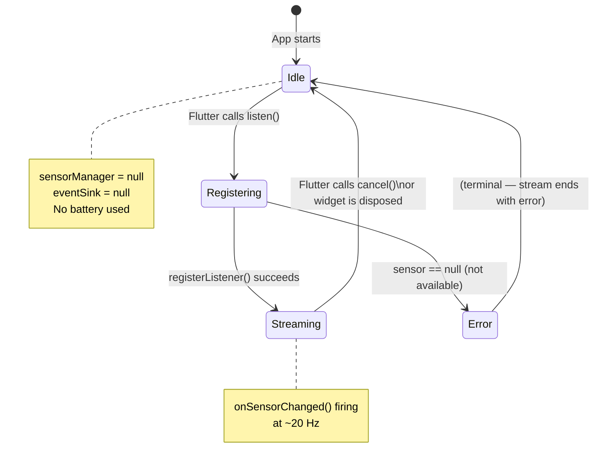

### onListen — What Happens When Flutter Subscribes

Triggered in Dart by:
```dart
_accelChannel.receiveBroadcastStream().listen(...)
```

This crosses the bridge and calls `onListen()` in Kotlin:

```kotlin
override fun onListen(arguments: Any?, events: EventChannel.EventSink?) {
    eventSink = events                                          // (1) save the sink
    firstEventLogged = false                                   // (2) reset log flag

    sensorManager = context.getSystemService(...)              // (3) get OS service
    val sensor = sensorManager?.getDefaultSensor(sensorType)  // (4) find the sensor

    if (sensor == null) {                                      // (5) error path
        eventSink?.error(ERROR_SENSOR_UNAVAILABLE, message, null)
        return
    }

    sensorManager?.registerListener(this, sensor, samplingPeriodUs) // (6) activate
}
```

Key decisions:
- **(1)** We store `events` as `eventSink`. This is the "pipe" we write data into.
- **(3-4)** `SensorManager` and the `Sensor` object are obtained fresh each time. This is slightly redundant but makes each `onListen` self-contained and safe to call repeatedly.
- **(5)** If the sensor does not exist on this device, we report an error through the sink rather than crashing. Flutter's stream will receive an error event.
- **(6)** `registerListener(this, ...)` — `this` refers to the `SensorStreamHandler` instance itself, because it implements `SensorEventListener`.

### onCancel — What Happens When Flutter Unsubscribes

Triggered in Dart by:
```dart
_accelSubscription?.cancel();
```

This calls `onCancel()` in Kotlin:

```kotlin
override fun onCancel(arguments: Any?) {
    sensorManager?.unregisterListener(this)  // (1) stop hardware polling
    sensorManager = null                     // (2) release reference
    eventSink = null                         // (3) clear the pipe
}
```

- **(1)** `unregisterListener(this)` tells Android to stop calling `onSensorChanged()`. The hardware can now go back to sleep or be used by other apps at their rate.
- **(2-3)** Nulling the references allows the garbage collector to free memory, and prevents any stale callbacks from accidentally writing to the old sink.

### Why Lazy Registration Matters

We do not call `registerListener()` in the `SensorStreamHandler` constructor. Registration happens inside `onListen()`, which is called only when Flutter actually subscribes. This means:

- If no screen is showing the sensor data, no sensor is running.
- Navigating away from the swing screen automatically stops the sensor.
- No manual "pause/resume" lifecycle code is needed in the Activity.

---

## 8. Threading and Performance Considerations

### Which Thread Runs What?

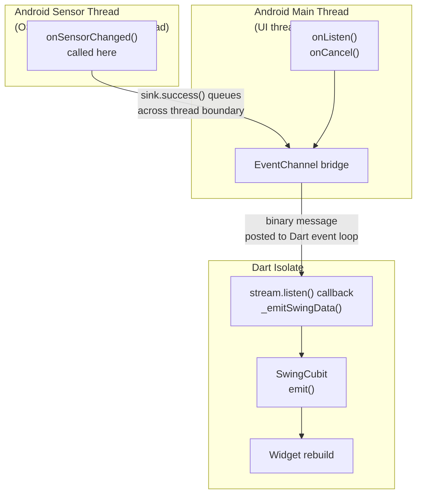

### Key Threading Facts

**`onSensorChanged` runs on a sensor background thread.** Android delivers sensor events on a dedicated thread, not the main UI thread. This is intentional — it avoids blocking the UI while waiting for hardware.

**`sink.success()` is thread-safe.** The Flutter engine's `EventSink` implementation uses internal synchronization to safely post messages to the Dart event loop from any thread.

**Dart callbacks run on the Flutter main isolate.** Once the data crosses the bridge, all our Dart code (`SensorService`, `SwingCubit`, widget `build()`) runs on Flutter's single-threaded event loop. No explicit locking is needed on the Dart side.

### Performance Characteristics at 20 Hz

| Operation | Frequency | Cost |
|---|---|---|
| `onSensorChanged()` fires | 20× per second | Negligible (OS-level) |
| 3 float→double conversions | 20× per second | Negligible |
| Binary serialization across bridge | 20× per second | ~0.1–0.5 ms |
| Dart stream callback runs | 20× per second | ~0.1 ms |
| Widget rebuild (via Cubit) | 20× per second | ~1–5 ms |
| **Total budget per frame** | | **~50 ms available** |

At 20 Hz the app has a 50 ms budget per reading. Even including UI rebuilds the total cost is well under 10 ms, leaving plenty of headroom.

### Why We Log Only the First Event

```kotlin
if (!firstEventLogged) {
    Log.d(TAG, "[$sensorType] First event: x=${values[0]}, ...")
    firstEventLogged = true
}
```

`Log.d()` at 20 Hz would generate **1,200 log entries per minute** — this floods `Logcat` and adds measurable overhead from string formatting. Logging only the first event confirms the sensor pipeline is working without the spam.

---

## 9. File-by-File Explanation

### Android (Kotlin) Files

#### [MainActivity.kt](../android/app/src/main/kotlin/com/example/flutter_project/MainActivity.kt)

**Responsibility:** Application entry point and platform channel registry.

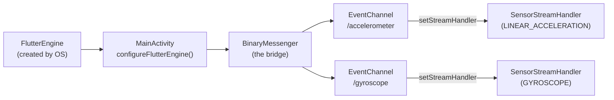

**What it does:**
- Overrides `configureFlutterEngine()` — the one correct lifecycle hook for registering platform channels.
- Obtains `BinaryMessenger` from the Flutter engine. This is the low-level communication object.
- Creates two `EventChannel` objects, each with a unique string name. The name is just an identifier; it must match exactly what Dart uses.
- Creates one `SensorStreamHandler` per channel, passing in the Android `Context`, the desired sensor type constant, and the sampling period.
- Sets each handler on its channel with `setStreamHandler()`.

**What it does NOT do:**
- It does not start any sensors. Sensor activation is deferred to `onListen()`.
- It does not hold references to the `SensorStreamHandler` objects. Once registered, the `EventChannel` holds the reference internally.

**Extensibility pattern:** To add a magnetometer, copy one block and change the channel name and sensor type. No other file needs to change.

---

#### [SensorStreamHandler.kt](../android/app/src/main/kotlin/com/example/flutter_project/SensorStreamHandler.kt)

**Responsibility:** Bridge between one Android sensor and one Flutter EventChannel stream.

This is the core of the native implementation. It implements two interfaces simultaneously:

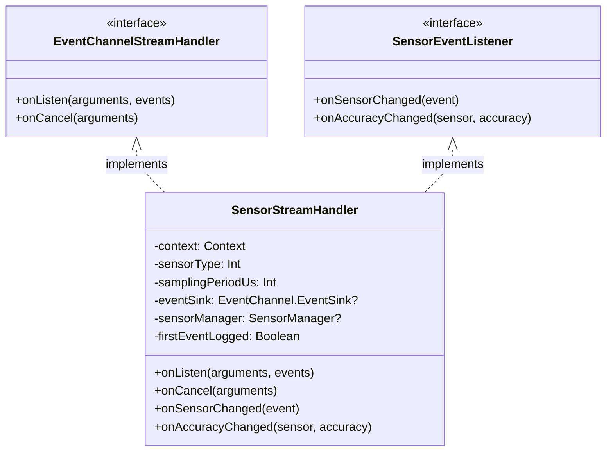

**Why it implements both interfaces on the same class:**

The class is the `StreamHandler` (knows when Flutter is listening) and the `SensorEventListener` (knows when hardware data arrives) at the same time. This means:
- It can gate data delivery: `onSensorChanged` checks whether `eventSink` is non-null before writing.
- There is no need for an intermediate object to coordinate between the two.
- Registration and unregistration are co-located with the data delivery logic.

**The `companion object` (Kotlin's equivalent of `static`):**

```kotlin
companion object {
    private const val TAG = "SensorStreamHandler"
    private const val ERROR_SENSOR_UNAVAILABLE = "SENSOR_UNAVAILABLE"
}
```

Constants defined here belong to the class, not to any instance. `TAG` is used for Logcat filtering; `ERROR_SENSOR_UNAVAILABLE` is the error code sent to Dart when a sensor is missing.

---

### Flutter (Dart) Files

#### [sensor_service.dart](../lib/features/swing/services/sensor_service.dart)

**Responsibility:** Subscribe to native EventChannels, compute derived physics metrics, and expose a `Stream<SwingData>`.

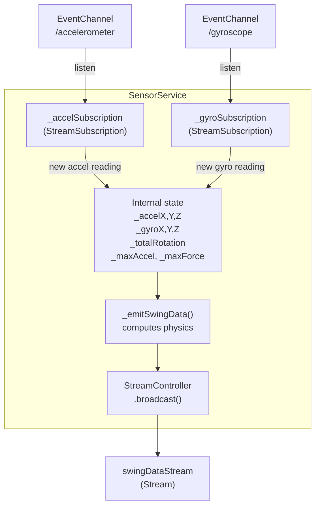

**Physics computations inside `_emitSwingData()`:**

| Computation | Formula | Code |
|---|---|---|
| Acceleration magnitude | `√(x² + y² + z²)` | `sqrt(_accelX² + _accelY² + _accelZ²)` |
| Force (Newton's 2nd law) | `F = m × a` | `_racketMassKg * acceleration` |
| Angular speed magnitude | `√(gx² + gy² + gz²)` | `sqrt(_gyroX² + _gyroY² + _gyroZ²)` |
| Rotation accumulation | `Δangle = ω × Δt × (180/π)` | `angularSpeed * dtSeconds * (180/pi)` |
| Swing detection | `a ≥ threshold` | `acceleration >= swingDetectionThreshold` |

**Why a `StreamController.broadcast()`?**

A *broadcast* stream allows multiple listeners (e.g., the Cubit plus any future debug screen). A single-subscription stream would throw an error if a second listener tried to subscribe. In our case only `SwingCubit` listens, but broadcast is the safer and more flexible choice.

**Why `_emitSwingData()` is only called from the accelerometer callback (not the gyroscope):**

The gyroscope callback only accumulates `_totalRotation`. The emit only fires when a new accelerometer reading arrives. This means every outgoing `SwingData` event is timestamped by the accelerometer cadence, and the gyroscope value used is simply "the most recent we have." This is a pragmatic choice — both sensors run at the same rate, so in practice the values are always fresh.

---

#### [swing_cubit.dart](../lib/features/swing/logic/swing_cubit.dart)

**Responsibility:** Translate sensor data stream events into UI-relevant states, and add behavioral logic (haptic feedback, state transitions).

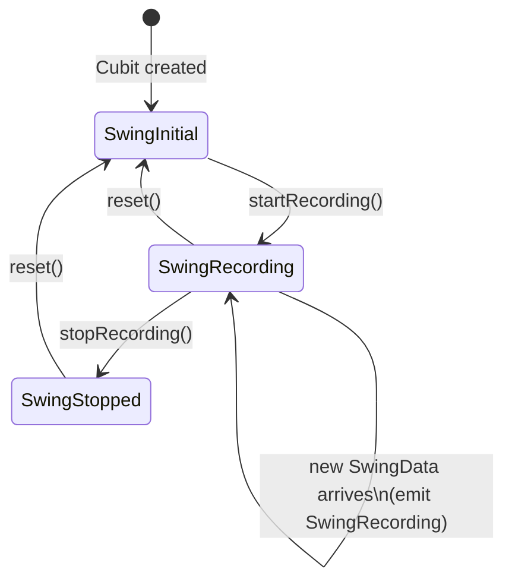

**Haptic feedback logic:**

```dart
if (swingData.swingDetected && !_hapticTriggered) {
    HapticFeedback.heavyImpact();
    _hapticTriggered = true;
}
if (!swingData.swingDetected) {
    _hapticTriggered = false;
}
```

This one-vibration-per-swing behavior is implemented by the `_hapticTriggered` boolean flag:
- Set to `true` when the first above-threshold reading arrives → vibrate once.
- Reset to `false` when acceleration drops back below threshold → ready for the next swing.
- Reset to `false` in `startRecording()` → each new recording session starts fresh.

---

#### [swing_state.dart](../lib/features/swing/logic/swing_state.dart)

**Responsibility:** Define all possible UI states as immutable data classes.

```mermaid
classDiagram
    class SwingState {
        <<sealed>>
    }
    class SwingInitial {
        (no data fields)
    }
    class SwingRecording {
        +SwingData data
    }
    class SwingStopped {
        +SwingData data
    }

    SwingState <|-- SwingInitial
    SwingState <|-- SwingRecording
    SwingState <|-- SwingStopped
```

The `sealed` keyword in Dart is critical: it means the Dart compiler knows every possible subclass at compile time. When you write a `switch` expression on a `SwingState`, the compiler forces you to handle all three cases and warns you if you miss one. This prevents runtime errors from unhandled states.

---

#### [swing_data.dart](../lib/features/swing/models/swing_data.dart)

**Responsibility:** Immutable data container representing a single moment in time.

All fields are `final`, making each `SwingData` instance a snapshot. The Cubit emits a new `SwingData` object every time sensor data arrives — it never mutates an existing object. This makes debugging easy: you can log any `SwingData` and it will never change after creation.

The `SwingData.empty()` factory provides a safe zero-value starting state, used by `SensorService.reset()` to push a "cleared" reading to any UI currently displaying old data.

---

## 10. Complete Data Flow: Hardware to UI

This diagram shows the full journey of a single sensor reading from the physical chip to a pixel on screen.

```mermaid
flowchart TD
    A["📱 Accelerometer chip\ndetects motion"]
    B["Android OS\nLinux kernel driver\ncollects raw readings"]
    C["SensorManager\nbatches & schedules\nevery 50ms"]
    D["onSensorChanged(SensorEvent)\n[SensorStreamHandler.kt:110]"]
    E["values[0,1,2] → List&lt;Double&gt;"]
    F["sink.success(list)\n[SensorStreamHandler.kt:120]"]
    G["StandardMessageCodec\nserializes to binary"]
    H["Platform Bridge\nBinaryMessenger"]
    I["StandardMessageCodec\ndeserializes to Dart types"]
    J["Stream&lt;dynamic&gt;\nreceiveBroadcastStream()"]
    K["_accelSubscription.listen()\n[sensor_service.dart:97]"]
    L["Cast to List\nextract x, y, z as double\n[sensor_service.dart:98-101]"]
    M["_emitSwingData()\ncompute magnitude, force\n[sensor_service.dart:165]"]
    N["StreamController.add(SwingData)\n[sensor_service.dart:201]"]
    O["swingDataStream\n(broadcast stream)"]
    P["_subscription.listen()\n[swing_cubit.dart:52]"]
    Q["Check swingDetected\nHapticFeedback if needed\n[swing_cubit.dart:56]"]
    R["emit(SwingRecording(data))\n[swing_cubit.dart:67]"]
    S["BlocBuilder&lt;SwingCubit, SwingState&gt;\nrebuilds on new state"]
    T["UI updates:\nmetric cards, animation,\nswing indicator\n[swing_screen.dart]"]

    A --> B --> C --> D --> E --> F
    F --> G --> H --> I --> J
    J --> K --> L --> M --> N --> O
    O --> P --> Q --> R
    R --> S --> T
```

**Total latency** from hardware reading to visible pixel: approximately **5–15 ms**, dominated by the Flutter widget rebuild. The sensor sampling interval of 50 ms is the primary constraint on responsiveness, not the code itself.

---

## 11. Error Handling and Cleanup Logic

### Error Path: Sensor Not Available

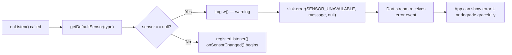

In [SensorStreamHandler.kt:75-80](../android/app/src/main/kotlin/com/example/flutter_project/SensorStreamHandler.kt#L75):

```kotlin
if (sensor == null) {
    val message = "Sensor type $sensorType is not available on this device."
    Log.w(TAG, "[$sensorType] $message")
    eventSink?.error(ERROR_SENSOR_UNAVAILABLE, message, null)
    return
}
```

The error code `"SENSOR_UNAVAILABLE"` is a string constant. On the Dart side, `EventChannel` errors surface as `PlatformException` objects, which can be caught with a standard Dart `try/catch` or stream `onError` handler.

### Cleanup Chain: What Happens When the User Stops

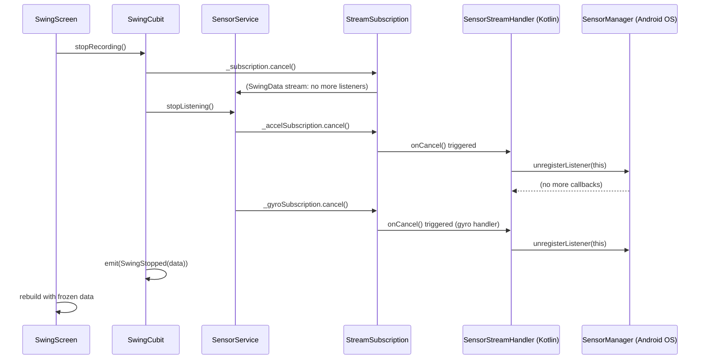

Every step in this chain is deterministic. After `stopRecording()` returns, there are zero active sensor listeners, zero open subscriptions, and zero risk of a zombie callback firing later.

### Cleanup Chain: Widget Disposal (Navigation Away)

When the user navigates away from `SwingScreen`, Flutter disposes the widget tree, which closes the `BlocProvider`. This triggers:

```
BlocProvider.dispose()
  → SwingCubit.close()
    → _subscription?.cancel()
    → _sensorService.dispose()
      → stopListening()       ← cancels accel + gyro subscriptions
      → _swingDataController.close()  ← closes the broadcast stream
```

The Kotlin `onCancel()` fires for both channels, unregistering both hardware sensors. **No sensors ever run after the screen is gone.**

### What Happens if the Flutter Engine Is Destroyed Abruptly?

If the Android process is killed (e.g., by the OS due to memory pressure), the entire JVM exits. All sensor registrations are automatically cleaned up by Android when the process dies. There is no partial state left behind.

---

## 12. Sequence Diagram: Full Request Lifecycle

This final diagram shows the complete timeline from app start to sensor streaming to cleanup.

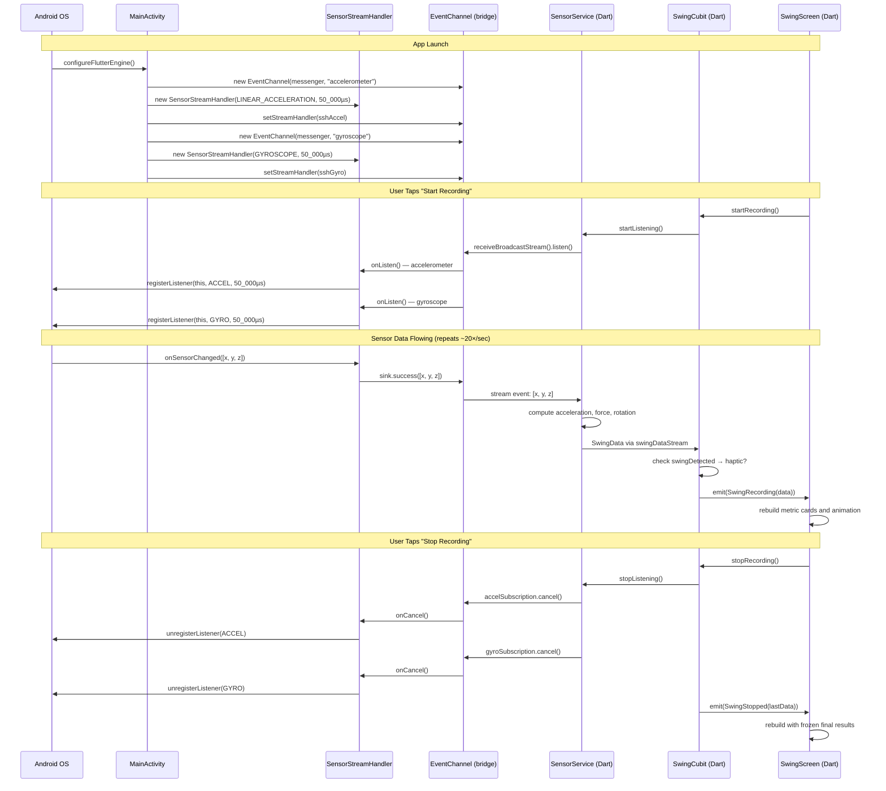

---

## Quick Reference

### Channel Names (must match exactly on both sides)

| Sensor | Channel Name |
|---|---|
| Accelerometer | `com.example.flutter_project/accelerometer` |
| Gyroscope | `com.example.flutter_project/gyroscope` |

### Key Constants

| Constant | Value | Defined In |
|---|---|---|
| `SAMPLING_PERIOD_US` | `50_000` µs (50 ms / 20 Hz) | `MainActivity.kt` |
| `defaultRacketMassKg` | `0.300` kg | `AppConstants.dart` |
| `swingDetectionThreshold` | `5.0` m/s² | `AppConstants.dart` |
| `sensorIntervalMs` | `50` ms | `AppConstants.dart` |

### File Map

| File | Language | Responsibility |
|---|---|---|
| [MainActivity.kt](../android/app/src/main/kotlin/com/example/flutter_project/MainActivity.kt) | Kotlin | Register EventChannels and StreamHandlers |
| [SensorStreamHandler.kt](../android/app/src/main/kotlin/com/example/flutter_project/SensorStreamHandler.kt) | Kotlin | Bridge sensor hardware to EventChannel |
| [sensor_service.dart](../lib/features/swing/services/sensor_service.dart) | Dart | Subscribe to channels, compute physics metrics |
| [swing_cubit.dart](../lib/features/swing/logic/swing_cubit.dart) | Dart | State management and haptic feedback logic |
| [swing_state.dart](../lib/features/swing/logic/swing_state.dart) | Dart | Sealed state classes for the UI |
| [swing_data.dart](../lib/features/swing/models/swing_data.dart) | Dart | Immutable data model for one sensor snapshot |
