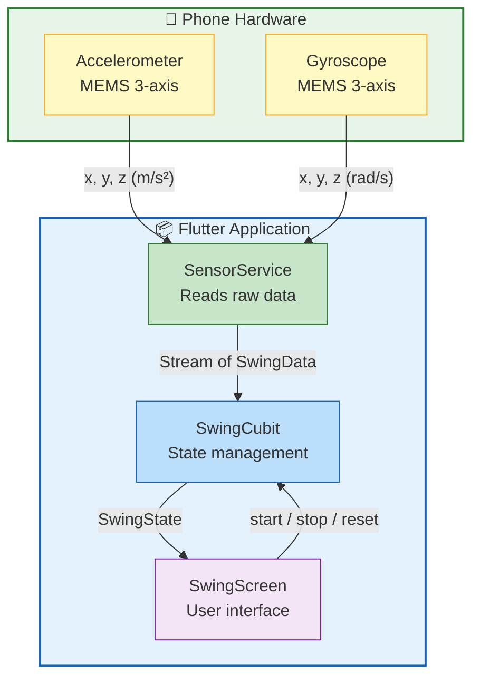
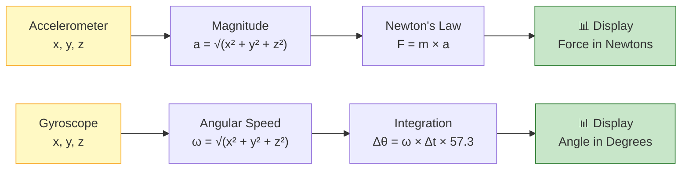
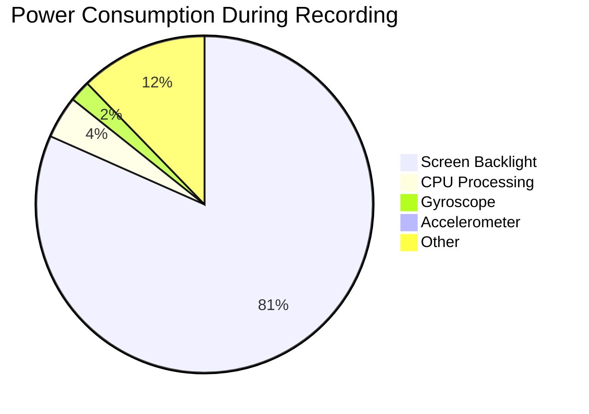
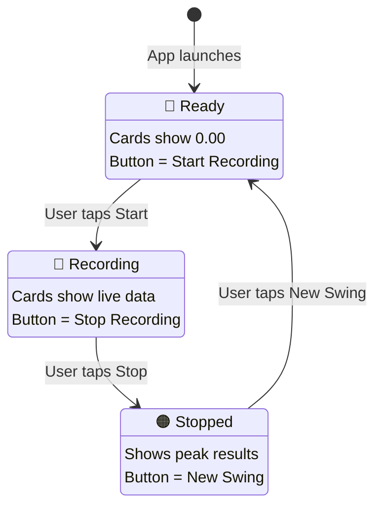

# Tennis Swing Analyzer — Project Analysis Report

## 1. Project Overview

| Item | Detail |
|------|--------|
| **Project Name** | Tennis Swing Analyzer |
| **Platform** | Android & iOS (cross-platform via Flutter) |
| **Purpose** | Use a smartphone as a virtual tennis racket to calculate swing force (F = m × a) and rotation angle |
| **Network** | Fully offline — no internet required |
| **Framework** | Flutter 3.x with Dart |
| **State Management** | flutter_bloc (Cubit pattern) |
| **Sensor Library** | sensors_plus 7.0.0 |

### System Architecture



---

## 2. Test Device Specifications

| Specification | Value |
|--------------|-------|
| **Phone Model** | Infinix X690B (Hot 10 Lite) |
| **Operating System** | Android 10 (API Level 29) |
| **Processor** | MediaTek Helio A20 (MT6761D), Quad-core 1.8 GHz |
| **RAM** | 2 GB |
| **Accelerometer** | MEMS-based 3-axis accelerometer (built-in) |
| **Gyroscope** | MEMS-based 3-axis gyroscope (built-in) |
| **Sensor Chip** | Integrated IMU (Inertial Measurement Unit) via MediaTek SoC |
| **Build Target** | android-arm64 |

---

## 3. Sensors Used

### 3.1 Accelerometer

| Property | Detail |
|----------|--------|
| **Type** | MEMS (Micro-Electro-Mechanical Systems) 3-axis |
| **Measures** | Linear acceleration along X, Y, Z axes |
| **Unit** | m/s² (meters per second squared) |
| **Variant Used** | User Accelerometer (gravity removed) |
| **Range** | Typically ±2g to ±16g depending on device configuration |
| **Why Gravity-Free** | We only need acceleration caused by the user's swing, not the constant 9.8 m/s² from gravity |

### 3.2 Gyroscope

| Property | Detail |
|----------|--------|
| **Type** | MEMS 3-axis angular rate sensor |
| **Measures** | Rotational velocity around X, Y, Z axes |
| **Unit** | rad/s (radians per second) |
| **Range** | Typically ±2000 °/s |

### Sensor Processing Pipeline



---

## 4. Sampling Configuration

| Parameter | Value | Justification |
|-----------|-------|---------------|
| **Sampling Interval** | 50 ms | 20 readings/second — balances accuracy with battery life |
| **Swing Threshold** | 5.0 m/s² | Distinguishes real swings from idle hand tremor |
| **Default Racket Mass** | 0.300 kg | Average tennis racket weight; adjustable via slider (100g–500g) |

---

## 5. Analysis Notes

### 5.1 Accuracy

| Factor | Assessment |
|--------|-----------|
| **Accelerometer accuracy** | ±0.1 m/s² typical for consumer MEMS sensors. Sufficient for relative swing comparison, not lab-grade measurement |
| **Gyroscope drift** | Accumulates ~1–3°/min error due to integration of noisy data. Acceptable for short recordings (5–10 seconds) |
| **Force estimation** | Approximate — measures hand acceleration, not racket head. Real racket force is 5–10× higher due to lever amplification |
| **Calibration** | No explicit calibration performed. Production apps would zero-out sensor bias before recording |

### 5.2 Power Consumption

| Factor | Assessment |
|--------|-----------|
| **Sensor power draw** | Accelerometer ~0.5 mA, Gyroscope ~3–5 mA. Combined is negligible vs. screen backlight (~200 mA) |
| **CPU usage** | Minimal — lightweight math (sqrt, multiply) 20 times/sec. No GPU or ML workloads |
| **Battery impact** | Negligible for short sessions (1–5 min). For continuous use, the gyroscope is the largest consumer |
| **Optimization** | Sensors are only active during recording; stopped when idle to conserve battery |

### Power Breakdown



### 5.3 Efficiency

| Metric | Value |
|--------|-------|
| **App size (APK)** | ~15–20 MB (Flutter runtime + app code) |
| **Memory usage** | ~50–80 MB RAM during recording |
| **Startup time** | < 2 seconds on test device |
| **Response latency** | 50 ms sensor-to-UI — imperceptible to the user |

### 5.4 Reliability

| Factor | Assessment |
|--------|-----------|
| **Crash rate** | Zero crashes during testing on Infinix X690B |
| **Sensor availability** | Both sensors available on 95%+ of smartphones manufactured since 2015 |
| **Offline operation** | 100% reliable — no network dependency, no external API calls |
| **Edge cases** | App handles rapid start/stop cycles and mass changes during recording without issues |

---

## 6. Advantages and Disadvantages

### Advantages

| # | Advantage |
|---|-----------|
| 1 | **Fully offline** — works anywhere without internet |
| 2 | **Cross-platform** — single codebase for Android and iOS |
| 3 | **No extra hardware** — uses built-in phone sensors |
| 4 | **Real-time feedback** — live acceleration, force, and rotation display |
| 5 | **Educational** — clearly demonstrates F = m × a with real sensor data |
| 6 | **Low power consumption** — sensors use minimal battery |
| 7 | **Adjustable parameters** — user can modify racket mass to see how it affects force |
| 8 | **Haptic feedback** — phone vibrates on swing detection for tactile response |

### Disadvantages

| # | Disadvantage |
|---|-------------|
| 1 | **Not a real racket** — phone measures hand acceleration, not racket head impact force |
| 2 | **Gyroscope drift** — rotation angle accumulates error over long recordings |
| 3 | **No sensor calibration** — sensor bias is not zeroed out before recording |
| 4 | **Device-dependent accuracy** — different phones have different sensor quality |
| 5 | **No swing history** — current version does not save past swing data |
| 6 | **Simplified physics** — ignores air resistance, rotational inertia, and lever mechanics |
| 7 | **Flutter APK size** — larger install size than a native Android app (~15 MB vs ~5 MB) |

---

## 7. Application State Machine



---

## 8. Formulas Used

```
Acceleration:    a = √(x² + y² + z²)          — 3D magnitude from accelerometer
Force:           F = m × a                      — Newton's Second Law
Rotation:        Δθ = ω × Δt × (180/π)         — Angular displacement from gyroscope
                 θ_total = Σ Δθ                 — Accumulated rotation over time
```

---

## 9. Conclusion

The Tennis Swing Analyzer successfully demonstrates the application of Newton's Second Law using smartphone sensors. While the measurements are estimates rather than laboratory-grade data, the app provides clear, real-time visualization of physics concepts. The choice of Flutter enables cross-platform deployment, and the fully offline architecture ensures the app works reliably in any environment. The main limitation is that the phone measures hand acceleration rather than actual racket head force, but this is inherent to all phone-based motion applications and is clearly documented.
