# Tennis Swing Analyzer — Team Guide

> **Who is this for?** Team members with **zero Flutter experience**.
> After reading this, you will understand every part of the project and be able to answer the professor's questions confidently.

---

## Table of Contents

1. [What Is Flutter?](#1-what-is-flutter)
2. [What Is Dart?](#2-what-is-dart)
3. [How Does Our App Work? (Big Picture)](#3-how-does-our-app-work-big-picture)
4. [The Physics Behind the App](#4-the-physics-behind-the-app)
5. [What Are Sensors?](#5-what-are-sensors)
6. [The Folder Structure (Where Is Everything?)](#6-the-folder-structure-where-is-everything)
7. [Understanding Each File](#7-understanding-each-file)
8. [State Management — What Is Cubit?](#8-state-management--what-is-cubit)
9. [How the Screen Changes](#9-how-the-screen-changes)
10. [Key Vocabulary the Professor May Ask About](#10-key-vocabulary-the-professor-may-ask-about)
11. [Common Questions and How to Answer Them](#11-common-questions-and-how-to-answer-them)

---

## 1. What Is Flutter?

Flutter is a **toolkit made by Google** for building mobile apps. One key advantage:

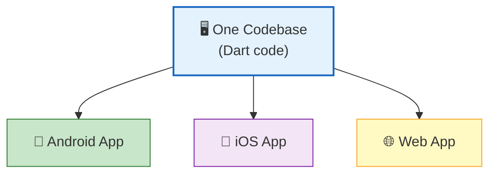

**You write the code ONCE, and it runs on both Android and iPhone.** No need to write two separate apps.

### Why we chose Flutter for this project:
- ✅ Works on both Android and iOS
- ✅ Fast development (hot reload — changes appear instantly)
- ✅ Large community and many pre-built packages
- ✅ The `sensors_plus` package gives easy access to phone sensors

---

## 2. What Is Dart?

Dart is the **programming language** used by Flutter. Think of it like:
- Flutter = the framework (the tools)
- Dart = the language (how you write the instructions)

You don't need to know Dart in depth, but here are the basics you'll see in our code:

```dart
// This is a variable (stores a value)
double acceleration = 9.8;

// This is a function (does something)
double calculateForce(double mass, double accel) {
  return mass * accel;  // F = m × a
}

// This is a class (a blueprint for an object)
class SwingData {
  final double acceleration;
  final double force;
}
```

---

## 3. How Does Our App Work? (Big Picture)

Here's the complete flow from when you swing the phone to when you see numbers on screen:

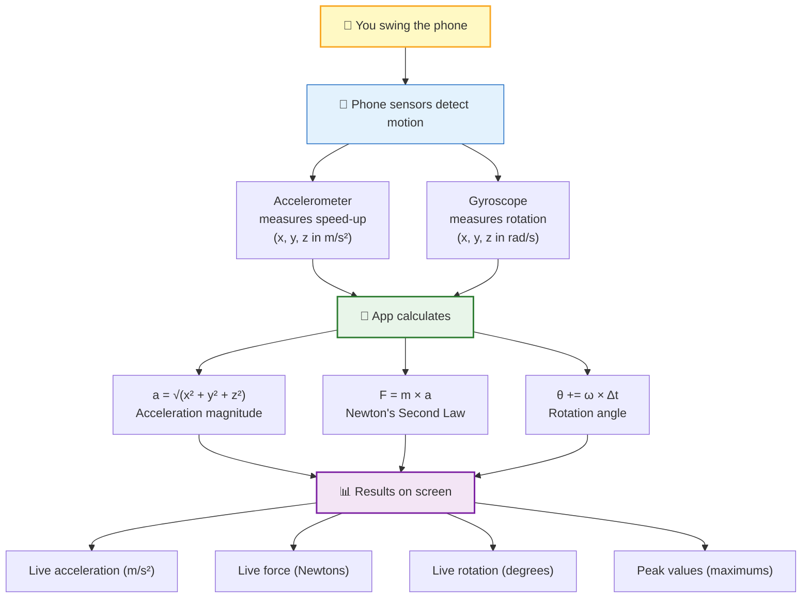

### In one sentence:
> **The phone sensors detect motion → our code does the math → the screen shows the results.**

---

## 4. The Physics Behind the App

### Newton's Second Law: F = m × a

This is the core formula of the entire project.

| Symbol | Name | Meaning | Our Value |
|--------|------|---------|-----------|
| **F** | Force | How hard the swing is | What we calculate (in Newtons) |
| **m** | Mass | Weight of the racket | 0.300 kg (adjustable by slider) |
| **a** | Acceleration | How fast the phone sped up | Measured by the accelerometer |

### Step-by-step calculation example:

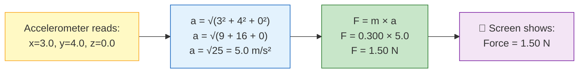

### Rotation Angle

The gyroscope tells us how fast the phone is spinning (in radians per second). We convert it to degrees:

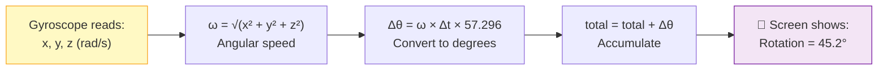

The number **57.296 = 180 ÷ π**, which converts radians to degrees.

---

## 5. What Are Sensors?

Sensors are **tiny hardware chips** inside your phone that detect physical properties.

### Accelerometer

Measures **how fast the phone speeds up** along 3 directions:

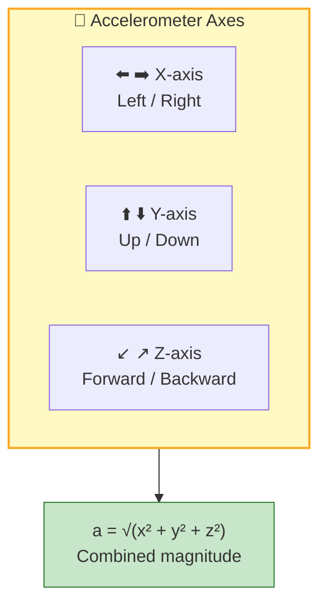

### Gyroscope

Measures **how fast the phone rotates** around each axis.

### Why We Use "User Accelerometer" (Not Regular)

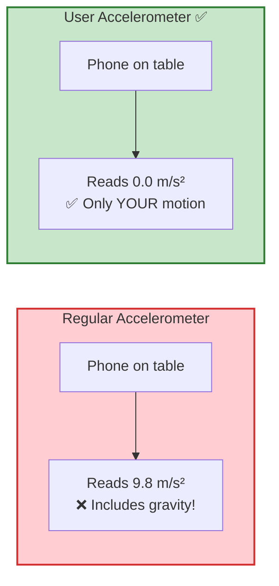

We use the **User Accelerometer** because we only want to measure the swing, not gravity.

---

## 6. The Folder Structure (Where Is Everything?)

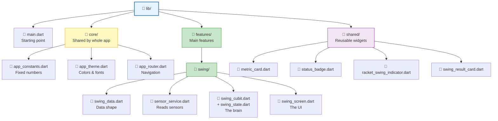

### Why is it organized this way?

Think of it like a **restaurant**:

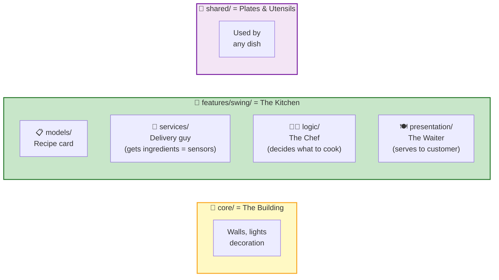

---

## 7. Understanding Each File

### `main.dart` — The Starting Point

**What it does:** Launches the app. Think of it as turning on the restaurant's "OPEN" sign.

**Key things it does:**
1. Locks the screen to portrait mode (because you hold the phone upright like a racket)
2. Creates the "brain" (SwingCubit) and the "delivery guy" (SensorService)
3. Starts the app with our green theme

---

### `app_constants.dart` — The Fixed Numbers

**What it does:** Stores all the important numbers in one place.

| Constant | Value | Why |
|----------|-------|-----|
| `defaultRacketMassKg` | 0.300 | Average tennis racket = 300 grams |
| `sensorIntervalMs` | 50 | Read sensors every 50 milliseconds (20 times/sec) |
| `swingDetectionThreshold` | 5.0 | Below 5 m/s² = just hand tremor, not a real swing |
| `minRacketMassKg` | 0.100 | Slider minimum = 100 grams |
| `maxRacketMassKg` | 0.500 | Slider maximum = 500 grams |

---

### `swing_data.dart` — The Data Shape

**What it does:** Defines what information we store for each sensor reading.

Think of it as a **form** that gets filled out 20 times per second:

```mermaid
graph TD
    subgraph SwingData["📋 SwingData Form"]
        direction TB
        L["🔴 Live Values"]
        L1["acceleration: ___ m/s²"]
        L2["force: ___ N"]
        L3["rotationAngle: ___ °"]
        
        P["🏆 Peak Values"]
        P1["maxAcceleration: ___ m/s²"]
        P2["maxForce: ___ N"]
        
        S["⚡ Swing Detection"]
        S1["swingDetected: Yes/No"]
        
        R["📡 Raw Sensor Readings"]
        R1["accel X ___ Y ___ Z ___"]
        R2["gyro X ___ Y ___ Z ___"]
    end

    style SwingData fill:#e3f2fd,stroke:#1565C0,stroke-width:2px
    style L fill:#ffcdd2,stroke:#D32F2F
    style P fill:#fff9c4,stroke:#F9A825
    style S fill:#c8e6c9,stroke:#2E7D32
    style R fill:#f3e5f5,stroke:#7B1FA2
```

---

### `sensor_service.dart` — The Sensor Reader

**What it does:** Connects to the phone's hardware sensors and does the math.

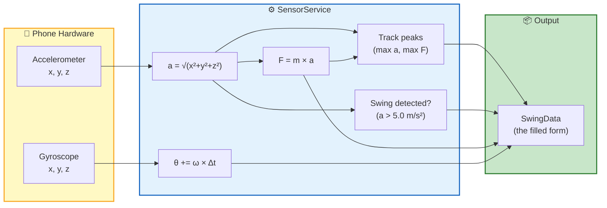

---

### `swing_cubit.dart` — The Brain

**What it does:** Controls the flow. Receives data from the sensor service, decides what state the app should be in, and tells the screen to update.

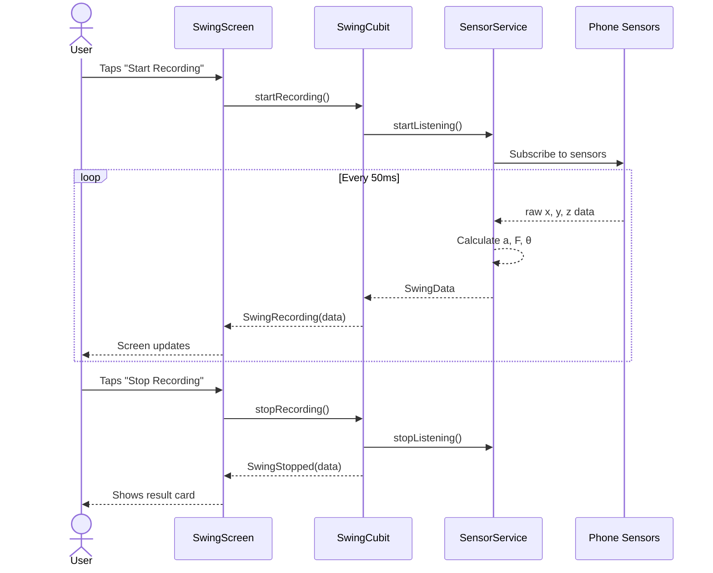

---

### `swing_state.dart` — The Three Possible States

The app can only be in **ONE** of these three states at any time:

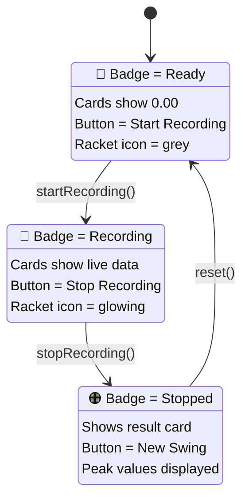

---

### `swing_screen.dart` — What the User Sees

**What it does:** Draws everything on the screen. It watches the Cubit and redraws itself whenever the state changes.

**Screen layout:**

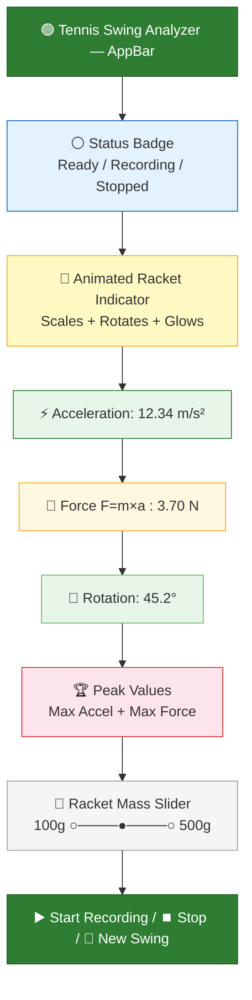

---

## 8. State Management — What Is Cubit?

### The Problem

When the user swings the phone, the numbers on screen need to change **20 times per second**. We need a way to manage this.

### The Solution: Cubit (from flutter_bloc package)

Think of a Cubit as a **TV remote control**:

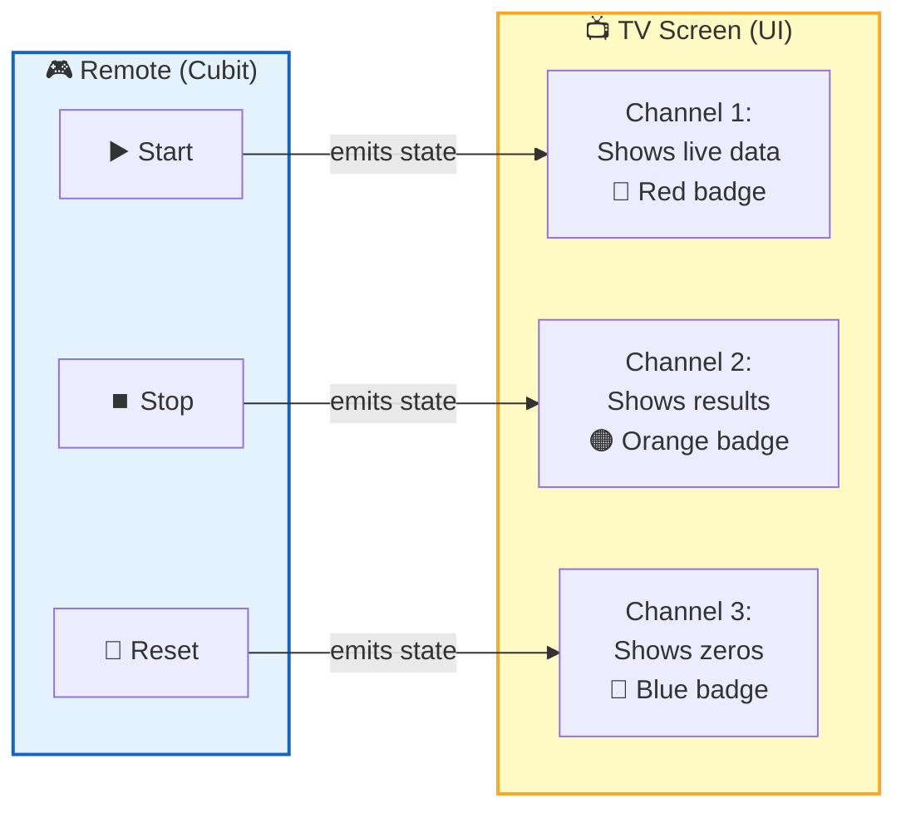

**You press a button (call a method) → the TV changes (state emits) → the screen updates.**

**Three buttons (methods):**
- `startRecording()` — starts sensors, emits SwingRecording state
- `stopRecording()` — stops sensors, emits SwingStopped state
- `reset()` — clears everything, emits SwingInitial state

---

## 9. How the Screen Changes

The UI uses a `BlocBuilder` widget — it **watches** the Cubit and **rebuilds** the screen whenever the state changes:

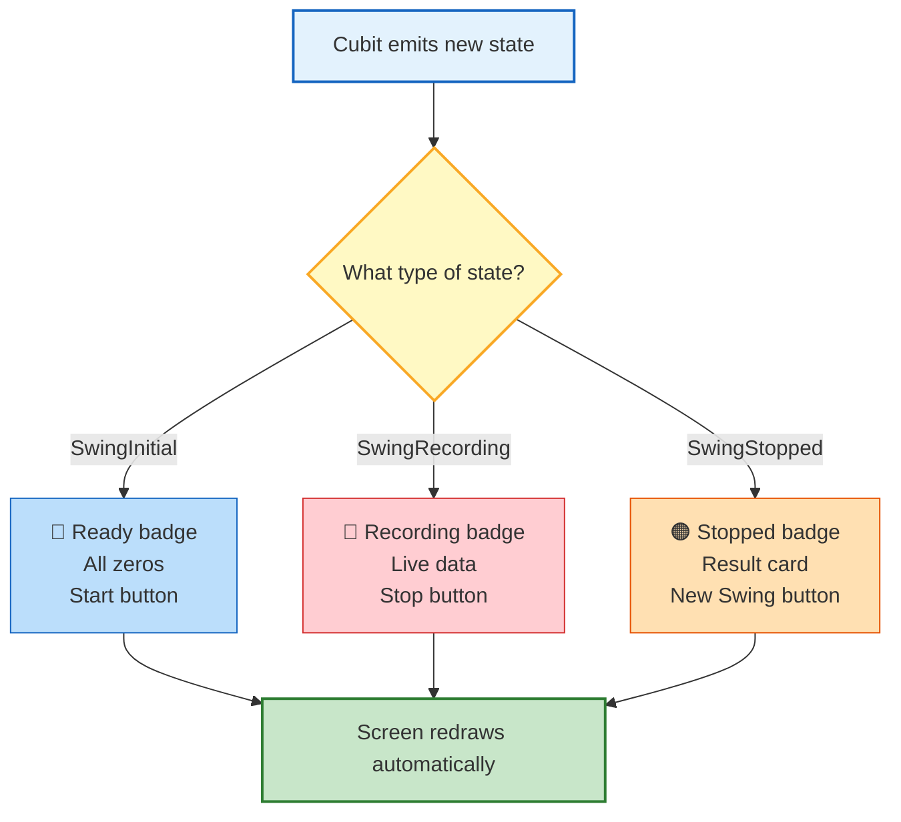

This happens **automatically** — we don't manually tell the screen to update. The Cubit emits a state, and the BlocBuilder handles the rest.

---

## 10. Key Vocabulary the Professor May Ask About

| Term | Simple Explanation |
|------|--------------------|
| **Flutter** | Google's toolkit for building Android + iOS apps from one codebase |
| **Dart** | The programming language Flutter uses |
| **Widget** | A building block of the UI (a button, a card, a text — everything is a widget) |
| **Cubit** | A simple state manager — you call methods, it emits states |
| **State** | The current "condition" of the app (Ready, Recording, or Stopped) |
| **BlocBuilder** | A widget that rebuilds itself when the state changes |
| **BlocProvider** | Creates the Cubit and makes it available to all widgets below it |
| **Dependency Injection** | Passing a service into a class instead of creating it inside — makes testing easier |
| **Stream** | A flow of data over time (like a water pipe — data keeps coming) |
| **MEMS** | Micro-Electro-Mechanical Systems — the tiny chip technology used in phone sensors |
| **IMU** | Inertial Measurement Unit — the combined accelerometer + gyroscope module |
| **Sealed class** | A class that can only be extended by subclasses in the same file — the compiler forces you to handle all cases |
| **Immutable** | An object that cannot be changed after it's created (all our SwingData objects are immutable) |

---

## 11. Common Questions and How to Answer Them

### "What does this app do?"
> "It turns a smartphone into a virtual tennis racket. When you swing the phone, it measures acceleration using the accelerometer, calculates force using Newton's Second Law (F = m × a), and measures rotation angle using the gyroscope. Everything runs offline."

### "Why Flutter and not native Android?"
> "Flutter lets us write one codebase that runs on both Android and iOS. It also has the sensors_plus package which gives easy access to phone sensors. And the hot reload feature speeds up development significantly."

### "How do you read sensor data?"
> "We use the sensors_plus package which provides Dart Streams for the accelerometer and gyroscope. We subscribe to these streams and receive x, y, z values 20 times per second."

### "What is F = m × a?"
> "It's Newton's Second Law. Force equals mass times acceleration. In our app, mass is the racket weight (default 0.3 kg, adjustable via slider) and acceleration is calculated from the accelerometer: the square root of x² + y² + z²."

### "How do you manage state?"
> "We use the Cubit pattern from the flutter_bloc package. The Cubit has three methods: start, stop, and reset. Each method emits a corresponding state. The UI uses BlocBuilder to automatically rebuild whenever the state changes."

### "How accurate is it?"
> "Phone sensors are MEMS-based with ±0.1 m/s² accuracy. This is sufficient for comparing relative swing strengths but not for laboratory measurements. The gyroscope drifts about 1–3 degrees per minute, which is acceptable for short recordings."

### "What are the limitations?"
> "Three main ones: (1) We measure hand acceleration, not racket head force — the real force would be higher due to lever mechanics. (2) The gyroscope drifts over time. (3) There's no sensor calibration before recording."

### "What would you improve?"
> "We'd add swing history saved to local storage, charts showing acceleration over time, sensor calibration at startup, and possibly machine learning to classify forehand vs. backhand swings."

### "Why is the mass adjustable?"
> "Because F = m × a — mass is a variable in the formula. If you change the mass and swing the same way, the force changes proportionally. The slider demonstrates this relationship visually."

### "What is a sealed class?"
> "It's a Dart feature that restricts which subclasses can exist. Our SwingState is sealed with exactly three subclasses: Initial, Recording, and Stopped. The compiler forces us to handle all three in every switch statement — so we can never accidentally forget a state."

---

> 💡 **Tip for the discussion:** If the professor asks something you're unsure about, connect your answer back to **F = m × a** and the **data flow** (Sensor → Service → Cubit → UI). These are the two things the whole project revolves around.
